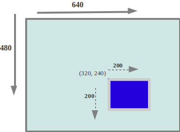

# Kreslení
Hlavním důvodem, proč používáme knihovnu SDL, je samozřejmě to, abychom mohli vykreslovat grafické prvky na obrazovku.
K tomu nám SDL nabízí spoustu užitečných funkcí. V podstatě všechny funkce pro vykreslování berou jako svůj (první)
parametr hodnotu typu `SDL_Renderer*`, která reprezentuje "kreslítko", do kterého se má něco vykreslit.

## Souřadný systém
Pro vykreslování je nejprve nutné vzít v potaz, jaký má SDL souřadný systém. Ten je znázorněný na následujícím obrázku:



Začátek souřadné soustavy je v bodě `(0, 0)`, který je umístěn v levém horním rohu okna. První souřadnice (`x`) určuje
sloupec, a roste zleva doprava. Druhá souřadnice (`y`) určuje řádek, a roste shora dolů. Takže např. v okně s šířkou `800`
a výškou `600` pixelů jsou souřadnice rohů následující:
- Levý horní roh: `(0, 0)`
- Pravý horní roh: `(799, 0)`
- Levý dolní roh: `(0, 599)`
- Pravý dolní roh: `(799, 599)`

Pokud je pro vás neintuitivní, že souřadnice `y` roste shora dolů (a ne zdola nahoru), můžete si ve vaší hře tuto souřadnici
virtuálně upravit a změnit si tak souřadný systém. V paměťové reprezentaci vaší hry můžete klidně používat souřadný systém,
kde `y` roste nahoru, a při vykreslování pomocí funkcí SDL pak akorát souřadnici `y` přepočítáte, aby odpovídala souřadnému
systému SDL. Tento přepočet lze provést jednoduše, stačí odečíst souřadnici `y` od výšky okna.

## Nastavení barvy štětce
Pokud chceme v SDL něco vykreslit, tak musíme nejprve nastavit barvu, kterou se má kreslit. To můžeme udělat zavoláním
funkce [`SDL_SetRenderDrawColor`](https://wiki.libsdl.org/SDL2/SDL_SetRenderDrawColor), která bere (kromě kreslítka)
čtyři parametry (`r`, `g`, `b`, `a`). Parametry `r`, `g` a `b` odpovídají červené, zelené a modré komponentě barvy, kterou
chceme nastavit pro kreslení. Hodnoty těchto komponent lze nastavovat v rozsahu `0` až `255`. Hodnota `a` odpovídá tzv.
alfa kanálu, který určuje průhlednost zvolené barvy. Obvykle průhlednost nemusíte řešit, a stačí tento parametr nastavit
na hodnotu `255`.

Nastavená barva zůstane aktivní, dokud ji nezměníme. Pokud tedy chceme vykreslit např. pět různých věcí stejnou barvou,
stačí barvu nastavit jednou, a poté vykreslit všechny požadované objekty.

## Čáry
Čáru můžete nakreslit pomocí funkce [`SDL_RenderDrawLine`](https://wiki.libsdl.org/SDL2/SDL_RenderDrawLine). Ta bere
(kromě kreslítka) čtyři parametry (`x1`, `y1`, `x2` a `y2`), které reprezentují souřadnice začátku a konce čáry.

```c
SDL_RenderDrawLine(renderer, 100, 100, 200, 200);
```

## Obdélníky
Nevyplněný obdélník můžete vykreslit pomocí funkce [`SDL_RenderDrawRect`](https://wiki.libsdl.org/SDL2/SDL_RenderDrawRect),
vyplněný obdélník poté pomocí funkce [`SDL_RenderFillRect`](https://wiki.libsdl.org/SDL2/SDL_RenderFillRect). Tyto funkce
vyžadují předání adresy na hodnotu struktury [`SDL_Rect`](https://wiki.libsdl.org/SDL2/SDL_Rect), která reprezentuje
obdélník. Pro vykreslení obdélníku tedy nejprve musíme vytvořit proměnnou typu `SDL_Rect`, nastavit jí pozici a rozměry,
a poté zavolat jednu z těchto dvou funkcí.

```c
SDL_Rect rect = {
    .x = 100,
    .y = 200,
    .w = 500,
    .h = 200
};
SDL_RenderFillRect(renderer, &rect);
```

Datový typ `SDL_Rect` se hodí nejenom pro vykreslování obdélníků. Můžete jej použít také na reprezentaci pozice a rozměru
různých objektů ve své hře. SDL také nabízí funkce pro kontrolu toho, jestli se dva obdélníky protínají, např. pomocí
funkce [`SDL_HasIntersection`](https://wiki.libsdl.org/SDL2/SDL_HasIntersection). Díky tomu můžete použít tyto obdélníky
také na detekci kolizí (např. na zjištění, jestli projektil trefil hráče).

Datový typ `SDL_Rect` ukládá pozici a rozměry obdélníku pomocí datového typu `int`. Pokud byste potřebovali obdélník,
kde tyto atributy budou reprezentované desetinnými čísly, můžete použít [`SDL_FRect`](https://wiki.libsdl.org/SDL2/SDL_FRect).

## Obrázky
SDL má také samozřejmě podporu nejenom pro kreslení čar či obdélníků, ale také pro kreslení (bitmapových) obrázků
(které můžeme načíst např. ze souborů ve formátu PNG nebo JPEG). Ke kreslení však budeme muset využít dodatečnou knihovnu
zvanou `SDL2_image`, kterou poté musíme přilinkovat k našemu programu při překladu:

```bash
$ gcc main.c -omain -lSDL2 -lSDL2_image
```

Poté musíme na začátku souboru, kde chceme funkce pro načítání obrázků použít, vložit odpovídající hlavičkový soubor:
```c
#include <SDL2/SDL_image.h>
```

Jakmile tohle uděláme, tak můžeme použít funkci [`IMG_LoadTexture`](https://wiki.libsdl.org/SDL2_image/IMG_LoadTexture),
která bere jako parametr kreslítko, a cestu k souboru na disku, ze kterého se má načíst obrázek, který poté budeme
vykreslovat:

```c
SDL_Texture* image = IMG_LoadTexture(renderer, "image.png");
```
Z funkce se nám vrátí ukazatel na strukturu [`SDL_Texture`](https://wiki.libsdl.org/SDL2/SDL_Texture), která reprezentuje
obrázek načtený v paměti grafické kartě, který je připravený k vykreslení.

> Při načítání obrázků (stejně jako jakýchkoliv jiných souborů) bychom si měli dát pozor na to, abychom k němu udali
> [správnou cestu](../../soubory/otevirani_souboru.md#cesta-k-souboru). Měli bychom také zkontrolovat, jestli se obrázek
> správně načetl, tj. jestli funkce nevrátila hodnotu `NULL`[^1]. Kontrolu si můžeme usnadnit pomocí makra [`assert`](../../soubory/otevirani_souboru.md#použití-assert).

[^1]: Pokud by funkce vrátila `NULL`, a my bychom se poté snažili tuto hodnotu vykreslit jako obrázek, tak může dojít
k [**nedefinovanému chování**](../../../ruzne/nedefinovane_chovani.md) 💣. Proto bychom měli vždy kontrolovat návratovou hodnotu této funkce.

Jakmile máme obrázek správně načtený, tak jej můžeme vykreslit pomocí funkce [`SDL_RenderCopy`](https://wiki.libsdl.org/SDL2/SDL_RenderCopy).
Této funkci musíme předat kreslítko, obrázek, který chceme vykreslit a dva obdélníky (`srcrect` a `dstrect`).
Parametr `srcrect` určuje výřez z obrázku, který chceme kreslit. Pokud chceme obrázek vykreslit celý, tak pro parametr
`srcrect` předáme hodnotu `NULL`. Parametr `dstrect` určuje, do jakého výřezu (obdélníku v plátnu) se má obrázek vykreslit.
Zde bychom si měli dát pozor, aby cílový obdélník měl stejný poměr stran, jako náš obrázek, jinak po vykreslení může být
obrázek značně zdeformovaný.

```c
SDL_Rect rect = {
    .x = 100,
    .y = 100,
    .w = 400,
    .h = 400
};
SDL_RenderCopy(renderer, image, NULL, &rect);
```

Užitečná je také funkce [`SDL_RenderCopyEx`](https://wiki.libsdl.org/SDL2/SDL_RenderCopyEx), která nám umožňuje vykreslit
obrázek, který je zarotovaný, případně zrcadlený podél vertikální či horizontální osy.

Jakmile přestaneme obrázek potřebovat, měli bychom jeho texturu uvolnit pomocí volání funkce [`SDL_DestroyTexture`](https://wiki.libsdl.org/SDL2/SDL_DestroyTexture):
```c
SDL_DestroyTexture(image);
```

## Text
Další užitečnou funkcionalitou, kterou nám SDL nabízí, a která je potřeba pro většinu her či grafických aplikací, je
vykreslování textu. K tomu budeme opět vyžadovat dodatečnou knihovnu, která se jmenuje `SDL2_ttf`:
```bash
$ gcc main.c -omain -lSDL2 -lSDL2_ttf
```

Pro práci s touto knihovnou budeme opět muset vložit odpovídající hlavičkový soubor:
```c
#include <SDL2/SDL_ttf.h>
```
a dále také zavolat inicializační funkci [`TTF_Init`](https://wiki.libsdl.org/SDL2_ttf/TTF_Init), kterou bychom měli
zavolat v programu někdy po zavolání funkce [`SDL_Init`](https://wiki.libsdl.org/SDL2/SDL_Init):
```c
SDL_Init(SDL_INIT_VIDEO);
TTF_Init();
```

Abychom mohli při vykreslování znaků používat průhlednost, a aby byly vykreslované obrázky jednotlivých znaků pěknější,
je vhodné na kreslítku (`SDL_Renderer`) zapnout takzvaný `Alpha blending`, a také povolit lineární vzorkování pixelů.
Na začátek programu (těsně po vytvoření kreslítka) si tedy přidejte tyto dva řádky:
```c
SDL_SetRenderDrawBlendMode(renderer, SDL_BLENDMODE_BLEND);
SDL_SetHint(SDL_HINT_RENDER_SCALE_QUALITY, "1");
```

Na konci programu bychom poté měli prostředky této knihovny opět uvolnit pomocí zavolání funkce [`TTF_Quit`](https://wiki.libsdl.org/SDL2_ttf/TTF_Quit):
```c
TTF_Quit();
```

Pro vykreslení nějakého textu budeme nejprve potřebovat nějaký (bitmapový) [font](https://en.wikipedia.org/wiki/Typeface),
ideálně ve formátu TTF. Můžete použít např. [tento](../../../static/Arial.ttf) font nebo si nějaký font stáhnout z internetu.
Font určuje, jak budou vypadat jednotlivé znaky textu, který se bude vykreslovat na obrazovku. Jakmile máte připravený
soubor s fontem, můžete ho ve svém programu načíst pomocí funkce [`TTF_OpenFont`](https://wiki.libsdl.org/SDL2_ttf/TTF_OpenFont):
```c
TTF_Font* font = TTF_OpenFont("Arial.ttf", 20);
```
První parametr udává cestu k souboru s fontem, druhý parametr udává velikost, ve které se má font načíst.
Až s fontem přestaneme pracovat (na konci programu), tak bychom jej měli opět uvolnit:
```c
TTF_CloseFont(font);
```

Jakmile máme načtený font, tak můžeme do kreslítka vykreslit nějaký text. Můžeme k tomu využít následující funkci,
která vyžaduje kreslítko, načtený font, barvu v podobě struktury [`SDL_Color`](https://wiki.libsdl.org/SDL2/SDL_Color),
obdélník označující pozici, kam se má text vykreslit, a poté samotný text, který se má vykreslit, ve formě řetězce:
```c
void sdl_draw_text(SDL_Renderer* renderer, TTF_Font* font, SDL_Color color, SDL_Rect location, const char* text)
{
    // Vykreslení textu se zadaným fontem a barvou do obrázku (surface)
    SDL_Surface* surface = TTF_RenderText_Blended(font, text, color);
    // Převod surface na hardwarovou texturu
    SDL_Texture* texture = SDL_CreateTextureFromSurface(renderer, surface);

    // Vykreslení obrázku
    SDL_RenderCopy(renderer, texture, NULL, &location);

    // Uvolnění textury a surface
    SDL_DestroyTexture(texture);
    SDL_FreeSurface(surface);
}
```
Tato funkce nejprve vytvoří obrázek s vykresleným textem, a poté obrázek vykreslí do kreslítka, stejně jako kdybychom
[kreslili](#obrázky) jakýkoliv jiný obrázek.

> Tento kód je relativně neefektivní, neboť při každém vykreslení vytváří dva nové obrázky (surface a texture), a poté
> je hned uvolňuje. Pro jednoduché hry by to však neměl být výkonnostní problém.
