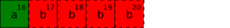
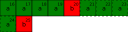
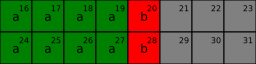

# Paměťová reprezentace struktur

> 🤓 Tato sekce obsahuje doplňující učivo. Pokud je toho na vás moc, můžete ji prozatím přeskočit
> a vrátit se k ní později.

V této kapitole si popíšeme, jak se překladač rozhoduje o tom, kolik bytů budou v paměti zabírat
proměnné struktur, které vytváříme v našich programech.

Když vytvoříme proměnnou struktury v paměti, tak bychom si intuitivně mohli myslet, že překladač
jednotlivé členy struktury "vysází" v paměti jeden za druhým. Nicméně není tomu tak vždy. Z důvodu
dodržení tzv. **zarovnání** (*alignment*) jednotlivých datových typů členů struktury se totiž
překladač může rozhodnout mezi tyto členy vložit nějaké byty navíc.

## Zarovnání
Každý datový typ v jazyce *C* má kromě své velikosti (počet bytů, které zabírá v paměti) také tzv.
**zarovnání**. Jedná se o číslo, které říká, na jakých adresách v paměti by ideálně měly být umístěny
hodnoty tohoto datového typu. Zarovnání `n` říká, že daný datový typ může ležet na adresách, které
jsou dělitelné číslem `n`. Takže např. datový typ se zarovnáním `4` může ležet na adresách `4`, `8`,
`12`, `200` nebo `512`, neměl by však ležet např. na adresách `1`, `3` nebo `134`, protože ty nejsou
dělitelné čtyřkou. Mohli bychom říct, že pro zarovnání `4` jsou adresy `4` nebo `8` **zarovnané**
(*aligned*), zatímco adresy `3` nebo `134` jsou **nezarovnané** (*unaligned*).

Zarovnání existuje z toho důvodu, že některé typy procesorů jsou navrženy tak, že jednoduše
nezvládnou načítat hodnoty z adres, které nesplňují zarovnání daného datového typu. Některé jiné
procesory to zase sice zvládnou, ale mnohem méně efektivněji, než kdybychom načítali hodnoty ze
zarovnaných adres.

Pokud to v našem programu neupravíme, tak primitivní datové typy mají zarovnání stejné, jako je
jejich velikost, a struktury mají zarovnání nastavené na nejvyšší zarovnání ze všech datových členů
typů dané struktury.

Zde jsou ukázky zarovnání pro několik základních datových typů:

- `char`: zarovnání `1`
- `int`: zarovnání je stejné velikost (tedy typicky `4`)
- `float`: zarovnání `4`
- `char*`: zarovnání je stejné velikost (tedy typicky `8`)

## Struktury a zarovnání
Zarovnání jednotlivých datových typů ovlivňuje to, jak překladač rozmístí jednotlivé členy struktur
v paměti. Bude se totiž snažit o to, aby každý člen struktury ležel na adrese, která bude zarovnaná
vzhledem k datovému typu daného členu. Vezměme si například následující strukturu:

> Poznámka: ve všech případech níže budeme předpokládat, že `short` zabírá `2` byty,
> `int` zabírá `4` byty, a ukazatel zabírá `8` bytů.

```c
typedef struct {
    char a;
    int b;
} Str1;
```

Jelikož `char` zabírá `1` byte a `int` zabírá `4` byty, mohli bychom si myslet, že `sizeof(Str1)`
bude `5`. Nicméně překladač musí zajistit, že člen `b` bude ležet na adrese, která bude zarovnaná
na `4` byty, protože zarovnání datového typu `int` je `4`. Dejme tomu, že by proměnná typu `Str1`
ležela třeba na adrese `16`, tj. i člen `a` by ležel na adrese `16`. Pokud by překladač umístil člen
`b` na adresu `17`, tak by tento člen ležel na nezarovnané adrese[^1]:



[^1]: Každá čtvercová buňka reprezentuje jeden byte. V pravém horním rohu buňky je znázorněna adresa buňky. Šedé buňky označují byty *paddingu*. Čerchované buňky obsahují nezarovnaná data.

Z tohoto důvodu překladač vloží za `a` tři byty tzv. **výplně** (*padding*). Tyto byty nebudou k
ničemu využívány, budou sloužit pouze k tomu, aby byl člen `b` správně zarovnaný. Struktura tedy bude
v paměti uložena takto, její velikost bude `8` bytů a její zarovnání budou `4` byty:


Překladač ovšem nevkládá výplň pouze mezi jednotlivé členy struktur. Někdy musí vložit výplň i na
samotný konec struktury. Podívejme se na následující strukturu `Str2`:

```c
typedef struct {
    int b;
    char a;
} Str2;
```

Mohlo by se zdát, že zde být výplň být nemusí, protože `int` může ležet "na začátku" struktury,
a `char` má zarovnání `1`, takže může ležet kdekoliv. Co by se ovšem stalo, kdybychom tyto struktury
uložili za sebe do paměti v poli?



První struktura v poli by byla zarovnaná správně, ale druhá (případně ty další) už ne! Z toho důvodu
musí překladač zajistit, že budou správně zarovnaní nejenom všichni členové struktury, ale i struktura
samotná. Zarovnání struktury se rovná nejvyššímu zarovnání ze všech členů struktury, v tomto případě
to bude `4`. Překladač tak musí zajistit, aby všechny struktury `Str2` (i když budou ležet v poli za
sebou) ležely na adresách, které budou násobky `4`. Z tohoto důvodu zde překladač vloží `3` byty výplně
i na konec struktury, aby byly proměnné této struktury správně zarovnané:



## Minimalizace velikosti struktury
Obecně bychom se měli snažit velikosti struktur minimalizovat, abychom v našich programech neplýtvali
pamětí. Existují různé [atributy](https://stackoverflow.com/a/8568441/1107768), kterými můžeme např.
překladači říct, aby zarovnání ignoroval, to ovšem nemusí být dobrý nápad, protože poté náš program
na určitých procesorech nemusí vůbec fungovat.

Univerzálnějším a bezpečnějším řešením je seřadit členy struktury tak, abychom minimalizovali
výplň. Obecná poučka zní řadit členy podle jejich velikosti, od největšího po nejmenší. Porovnejte
například následující dvě struktury:

- Neseřazené členy, velikost `24` bytů, `10` bytů výplně:
    ```c
    typedef struct {
        char a;
        int b;
        char c;
        const char* d;
    } Str3;
    ```

    

- Seřazené členy, velikost `16` bytů, `2` byty výplně:
    ```c
    typedef struct {
        const char* a;
        int b;
        char c;
        char d;
    } Str4;
    ```

    

## Kvíz 🤔
Zde je několik ukázek struktur, na kterých si můžete otestovat své znalosti zarovnání a výplně.

- `S1`
    ```c
    typedef struct {
        int a;
        const char* b;
    } S1;
    ```

    <details>
    <summary>Velikost a zarovnání</summary>

    Velikost `16` bytů, zarovnání `8` bytů, výplň `4` byty.

    

    </details>
- `S2`
    ```c
    typedef struct {
        char a[4];
        char b;
    } S2;
    ```

    <details>
    <summary>Velikost a zarovnání</summary>

    Velikost `5` bytů, zarovnání `1` byte, výplň `0` bytů. Člen `a` má sice také `4` byty, jako `int`,
    nicméně jelikož je zarovnání datového typu `char` pouze `1`, tak i zarovnání tohoto pole je `1`.
    A jelikož člen `b` může taktéž ležet na libovolné adrese, tak zde není přidána žádná výplň. 

    

    </details>
- `S3`
    ```c
    typedef struct {
        short a;
        char b;
        char c;
        int d;
    } S3;
    ```

    <details>
    <summary>Velikost a zarovnání</summary>

    Velikost `8` bytů, zarovnání `4` byty, výplň `0` bytů.

    

    </details>
