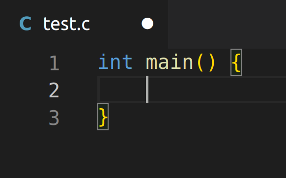
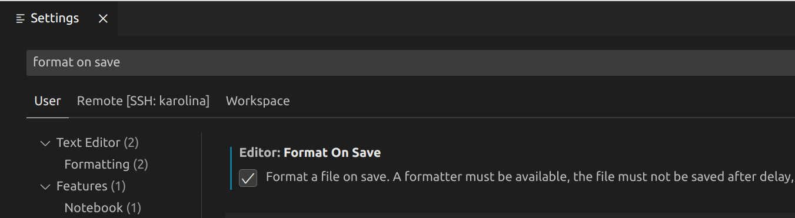

# Vývojové prostředí
Abychom mohli přeložit a spustit nějaký program, musíme ho obvykle nejprve zapsat do
jednoho nebo více souborů ve formě tzv. **zdrojového kódu** (*source code*). K usnadnění tohoto procesu
existují **textové editory** a **vývojová prostředí** jako například `MS Visual Studio`, `QtCreator`, `JetBrains CLion`,
`CodeBlocks`, `Visual Studio Code`, `vim`, `emacs` apod. Tyto programy usnadňují psaní kódu pomocí zvýrazňování
syntaxe, automatizace překladu, spouštění a testování programů a také správy projektů.

Na cvičeních UPR budeme používat editor `Visual Studio Code`, který je
[dostupný zdarma](https://code.visualstudio.com/). Níže je stručný návod k jeho použití. Při
programování se hodí detailně znát a efektivně využívat editor, který používáte, ale pro začátek
nám budou stačit naprosté základy.

## Instalace VSCode
- Pokud používáte virtualizovaný nebo nativní Linux (Ubuntu), stáhněte si [odsud](https://code.visualstudio.com/)
`.deb` soubor s balíčkem VSCode a nainstalujte jej (poklikáním myši na soubor nebo spuštěním příkazu
    ```bash
    $ sudo apt install ./<nazev-souboru>.deb
    ```
- Pokud používáte `WSL`, tak by už měl být VSCode předinstalovaný[^1]. Spustíte ho tak, že v `bash`
terminálu spustíte tento příkaz:
    ```bash
    $ code .
    ```
    Ten otevře VSCode v adresáři, ve kterém se zrovna v terminálu budete nacházet. Ve VSCode
    si poté také nainstalujte dodatečné rozšíření
    [`Remote Development`](https://marketplace.visualstudio.com/items?itemName=ms-vscode-remote.vscode-remote-extensionpack)
    (viz návod, jak instalovat rozšíření [níže](#instalace-potřebných-rozšíření-pomocí-uživatelského-rozhraní)).

    Podrobný návod, jak zprovoznit VSCode v kombinaci s WSL, naleznete
    [zde](https://code.visualstudio.com/docs/remote/wsl) nebo [zde](https://code.visualstudio.com/docs/cpp/config-wsl).

[^1]: Pokud by tomu tak nebylo, návod na instalaci VSCode na Linuxu naleznete
[zde](https://code.visualstudio.com/docs/setup/linux).

### Chybějící hlavičkové soubory
Pokud spustíte VSCode, otevřete v něm nějaký program s *C* kódem a budete mít červeně podtržený např.
takovýto řádek:
```c
#include <stdio.h>
```
tak je to pravděpodobně způsobeno jednou z dvou následujících věcí:
1) Spouštíte VSCode z Windows a ne z Ubuntu WSL terminálu. Spouštějte VSCode vždy přímo z Ubuntu
terminálu, aby mělo správný přístup k systémovým souborům jazyka *C*. Viz
[VSCode na WSL](linux/instalace.md#visual-studio-code).
2) Nemáte nainstalovaný překladač (`gcc`). Spusťte Ubuntu terminál a nainstalujte jej, viz
[překlad programu](preklad_programu.md).

> Obecně řečeno, to, že se vám ve VSCode ukazuje nějaký problém s kódem, ještě neznamená, že tento
> problém v kódu opravdu je. Důležité je, co řekne [překladač](preklad_programu.md) při překladu
> programu, VSCode je občas zmatené anebo není správně nastavené. Samozřejmě je ale ideální si ho správně
> nastavit, ať vás to neplete.

## Instalace rozšíření (pomocí terminálu)
VSCode podporuje programovací jazyky pomocí rozšíření, po první instalaci VSCode
tak nejprve musíme nainstalovat potřebná rozšíření pro jazyk *C*. V terminálu spusťte tyto příkazy:

```bash
$ code --install-extension ms-vscode.cpptools
```

Doporučujeme si také nainstalovat následující [rozšíření](https://marketplace.visualstudio.com/items?itemName=jakub-beranek.memviz) pro vizualizaci paměti programů, které jsme pro vás nachystali:

```bash
$ code --install-extension jakub-beranek.memviz
```

## Instalace rozšíření (pomocí uživatelského rozhraní)
1. Spusťte Visual Studio Code
2. Otevřete obrazovku rozšíření (`Ctrl+Shift+X` nebo spusťte akci `Install Extensions`)
3. Vyhledejte rozšíření (`C/C++`) a nainstalujte jej

Můžete také vyhledat `memviz` a nainstalovat rozšíření [Memory visualizer](https://marketplace.visualstudio.com/items?itemName=jakub-beranek.memviz) pro vizualizaci paměti. 

## Ukázka nastavení projektu
Jako vzorový projekt můžete použít [tuto](https://github.com/geordi/upr-course/tree/master/faq/vscode-template-project)
šablonu. Pro otevření adresáře ve VSCode klikněte na `Soubor (File) -> Otevřít adresář (Open Folder)`
a vyberte nějaký adresář, ve kterém chcete programovat.


## Ukládání souborů
Pokud v otevřeném zdrojovém souboru provedete nějaké změny, tak se neuloží na disk, dokud soubor neuložíte (pomocí
klávesové zkratky `Ctrl + S`). Občas se studentům stává, že provedou změnu, poté se snaží přeložit program, ale jejich
změny se neprojeví a studenti nerozumí, proč tomu tak je. Často je to právě proto, že soubor není uložen!
**Neuložený soubor** poznáte tak, že v záložce s názvem souboru je bílé kolečko:


Vždy tak po provedení změn ukládejte soubor pomocí `Ctrl + S`, případně si můžete v nastavení (`Settings`) zapnout volbu
`Auto Save`.

## Automatické formátování kódu
Pokud s programováním začínáte, tak budete ze začátku nejspíše trochu bojovat s tím, jak zformátovat zdrojový kód,
aby byl přehledný a dalo se v něm vyznat. Tuto činnost však můžete nechat plně na editoru či vývojovém prostředí.
Ve Visual Studio Code můžete použít klávesovou zkratku `Ctrl + Shift + I`, která vám právě otevřený soubor s kódem
automaticky zformátuje.

Můžete si dokonce editor nastavit tak, aby po každém uložení souboru kód automaticky zformátoval. Klikněte na
`File -> Preferences -> Settings`, poté do vyhledávacího okénka napište `Format On Save` a zaškrtněte tuto možnost:


## Pokročilé možnosti nastavení projektu
Pokud byste si chtěli nastavit VSCode tak, aby překládal nebo spouštěl váš program s jiným, než základním
nastavením, můžete k tomu využít konfiguraci pomocí souborů `launch.json`, který definuje, jak bude VSCode
váš program spouštět, případně `tasks.json`, pomocí kterého můžeme nastavit, jak se bude program překládat.

`launch.json` je možno vytvořit po kliknutí na záložku `Run and Debug` (Ctrl+Shift+D) a poté na tlačítko `create a
launch.json file` (tlačítko se zobrazí, pokud máte otevřený C soubor ve VSCode). Soubor se vytvoří v současně otevřeném
adresáři, ve složce `.vscode` (můžete ho případně i vytvořit manuálně).

Do vygenerovaného souboru můžete zkopírovat tento obsah:
```json
{
    "version": "0.2.0",
    "configurations": [
        {
            "name": "C program (gdb) Launch",
            "type": "cppdbg",
            "request": "launch",
            "program": "${workspaceFolder}/main",
            "args": [],
            "cwd": "${workspaceFolder}",
            "MIMode": "gdb",
            "miDebuggerPath": "/usr/bin/gdb",
            "preLaunchTask": "C compile"
        }
    ]
}
```

Atributy této konfigurace poté můžete upravovat. Užitečné pro vás budou zejména tyto atributy:
- **program** - cesta ke **spustitelnému** (přeloženému) souboru, který bude konfigurace spouštět
- **cwd** - pracovní adresář, ve kterém se program spustí
- **args** - [argumenty příkazového řádku](../ruzne/funkce_main.md#vstupní-parametry-funkce-main) předané
  spouštěnému programu

Pokud byste si chtěli při ladění přesměrovat obsah souboru na [standardní vstup](../c/text/vstup.md) programu,
tak přidejte na konec `args` šipku doleva a cestu k souboru, který chcete přesměrovat na vstup:
```json
"args": [
    "<",
    "${workspaceFolder}/stdin_file.stdin"
]
```

Dále budete muset nastavit soubor **tasks.json**, pro automatický překlad programu
(vytvořte jej opět ve `.vscode` složce projektu). Pokud tento soubor bude chybět, při pokusu o ladění programu
dostanete chybovou hlášku podobnou této:

> launch: program `<cesta>/main` does not exists

Do `tasks.json` si můžete zkopírovat tento obsah:
```json
{
    "version": "2.0.0",
    "tasks": [
        {
            "type": "cppbuild",
            "label": "C compile",
            "command": "gcc",
            "args": [
                "${workspaceFolder}/main.c",
                "-g",
                "-o",
                "${workspaceFolder}/main"
            ]
        }
    ]
}
```

Zde jsou důležité hlavně dva atributy:
- **label** - název tasku pro spuštění. **Tento název musí odpovídat atributu `preLaunchTask` v souboru `launch.json`**.
- **args** - [parametry překladače](../ruzne/parametry_prekladace.md) použité při překladu.
  - Prvním argumentem by měla být cesta k překládanému C zdrojovému souboru.
  - Dále by v `args` měla být cesta k výslednému přeloženého souboru, předaná za parametrem `-o`.
    **Tato cesta musí odpovídat atributu `program` v souboru `launch.json`**.
  - Dále zde můžete předávat další parametry překladače, např. zapnout [Address sanitizer](ladeni.md#address-sanitizer)
    (`-fsanitize=address`) nebo přilinkovat nějaké [knihovny](../c/modularizace/knihovny.md) (např. `-lm`).

Více informací o možnostech nastavení těchto dvou souborů můžete naleznout na těchto odkazech:
- [Microsoft Configure C/C++ debugging](https://code.visualstudio.com/docs/cpp/launch-json-reference)
- [Microsoft Variables Reference](https://code.visualstudio.com/docs/editor/variables-reference)

## Užitečné zkratky 
- Spustit program - `F5`
- Naformátovat kód - `Ctrl + Shift + I`
- Uložit provedené změny v souboru - `Ctrl + S`
- Zobrazit vyhledávač akcí - `Ctrl + Shift + P`
