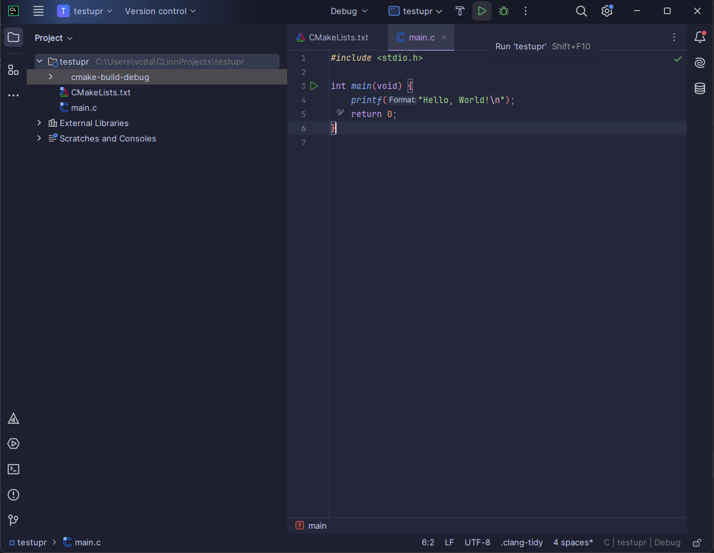

# Instalace CLionu

Nejlepší způsob instalace je použití aplikace [Toolbox](https://www.jetbrains.com/toolbox-app/), která vám umožní spravovat všechna vaše IDE od JetBrains. Pokud narazíte na problém, kompletní návod
naleznete [zde](https://www.jetbrains.com/help/clion/installation-guide.html#toolbox).

## Licence

CLion nabízí 30denní zkušební verzi (trial) pro vyzkoušení. Pokud chcete CLion používat po této době, můžete požádat o [školní licenci](https://www.jetbrains.com/shop/eform/students).

- Na stránce jsou čtyři způsoby, jak licenci získat. Nejjednodušší je použít váš školní e-mail. Pokud jej neznáte, můžete jej najít vlevo nahoře v [Roundcube](https://posta.vsb.cz/roundcube/).
- Po vyplnění dotazníku vám přijde potvrzovací e-mail o schválení **Educational Packu**. Otevřete odkaz v e-mailu a potvrďte podmínky. Poté si vytvořte účet s vaším školním
  e-mailem [zde](https://account.jetbrains.com/login).
- Stav vaší licence můžete zkontrolovat [zde](https://account.jetbrains.com/licenses). Zde také uvidíte všechny produkty, na které se licence vztahuje.

- Nakonec se stačí v **Toolboxu** přihlásit pod účtem, který jste si vytvořili.

  

## První projekt

Po spuštění CLionu klikněte na `New Project` a vyberte `C Executable`. Nastavte umístění projektu a můžete také zvolit standard jazyka C, který lze později změnit i v CMaku. Program spustíte pomocí
klávesové zkratky `Shift + F10` nebo kliknutím na tlačítko **Run**.

  

### Výběr kompilátoru

Pokud chcete používat **gcc** kompilátor z **WSL**, stačí jej přepnout v nastavení.

1. Stisknutím klávesové zkratky `CTRL + Shift + A` otevřete vyhledávací okno.
2. Napište **Toolchains** a stiskněte `Enter`.
3. Pokud máte správně nainstalované WSL, mělo by se objevit v nabídce. Klikněte na něj a posuňte jej nahoru pomocí `Alt + Up`.
4. Potvrďte kliknutím na **Apply** a následně **OK**.

> ⚠️ Pokud vám program nejde spustit po přepnutí na WSL, může to být způsobeno chybějícími balíčky nebo starší verzí CMake.

Nainstalujte potřebné balíčky:

```bash
$ sudo apt-get install build-essential cmake gdb
```

V souboru CMakeLists.txt nastavíme starší verzi CMaku na verzi 3.21

```cmake
cmake_minimum_required(VERSION 3.21)
```

>Pokaždé, když v CMaku uděláme změnu je potřeba soubor znovu načíst. Buď si zapnete auto-reload pomocí příkazu ```Auto-Reload CMake Project``` nebo kliknete na soubor pravým a dáte ```Reload CMake Project```

Pokud chcete pochopit fungování CMaku a jak naimportovat SDL pro následující projekt můžete najít [zde](cmake.md).