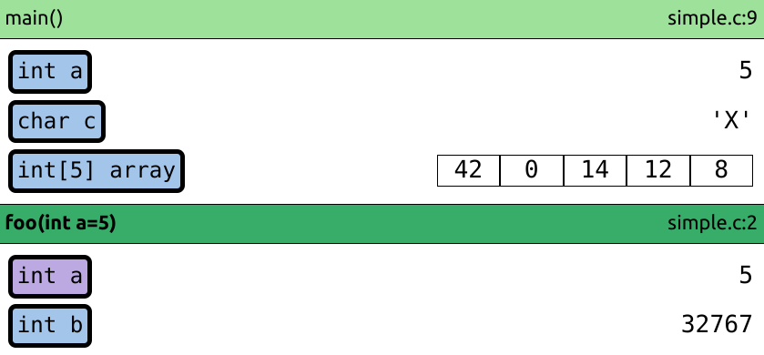

# Ladění programů
Tato sekce slouží k řešení často se vyskytujících problémů při programování v C. Pokud váš program
padá při běhu nebo se nechová tak, jak má, tak v něm nejspíše máte nějakou chybu (tzv. **bug**).
Proces hledání chyby, která způsobuje pád nebo špatné chování programu se pak nazývá **ladění** (*debugging*).

**Zejména se podívejte na sekci o [krokování](#krokování)!**

### Chyby při překladu programu
Pokud váš program nelze přeložit a překladač vypisuje nějakou chybovou hlášku, tak máte v zápisu programu
nějakou chybu, obvykle v syntaxi, tedy zápisu kódu. Je dobré si danou chybovou hlášku pořádně přečíst,
obvykle se odkazuje na relativně přesné místo, kde máte kód špatně, a někdy dokonce i nabízí řešení,
jak problém vyřešit.

Při překladu můžete dostat například následující chybovou hlášku:
```bash
main.c: In function ‘main’:
main.c:2:2: error: ‘a’ undeclared (first use in this function)
    2 |  a = 0;
```
Tato konkrétní chyba byla způsobena tím, že byla použitá proměnná bez její předchozí deklarace. Pokud
chybě nerozumíte, zkuste ji nejprve vygooglit, ideálně pouze část, která není konkrétně závislá na
podobě vašeho projektu. Nemá cenu googlit `main.c:2:2`, protože tento text je závislý na tom, jak jste
si pojmenovali své soubory, ostatní programátoři nejspíše mají jiné názvy souborů. V případě této chyby
by tedy bylo lepší googlit text `error: undeclared (first use in this function)`.

Může se stát, že překladač vypíše více chybových hlášek zároveň, i když chyba
v programu je pouze jedna. Zkuste scrollovat výstupem hlášek nahoru, abyste zjistili, která chyba
byla vypsána jako první, zbytek výpisu může být "planý poplach".

Pokud se vám nedaří chybu vygooglit, tak kontaktujte svého cvičícího.

Při překladu můžete použít dodatečné přepínače, při jejichž použití vydá překladač více varování o
možných problémových místech ve vašem kódu:

```bash
$ gcc -Wall -Wextra -pedantic -Werror=uninitialized -Werror=vla -Werror=return-type ...
``` 

Podívejte se také do sekce [Časté chyby](../caste_chyby/caste_chyby.md), kde je seznam často se
vyskytujících chyb.

### Chyby při běhu programu
Pokud váš program tzv. "padá" při běhu, můžete zkusit následující způsoby ladění:

#### Address sanitizer
Tento nástroj modifikuje váš program tak, aby dokázal detekovat značné množství chyb při jeho běhu,
a pokud nějakou chybu najde, tak váš program okamžitě ukončí a popíše, k jakému problému došlo. 
```bash
$ gcc -g -fsanitize=address main.c -o program
```
Jakmile takto přeložený program spustíte a dojde k nějaké chybě, tak bude její popis vypsán na výstup.

Pokud se chyba opraví těsně po svém vzniku, je to mnohem jednodušší, než když se chyba projeví až
později v úplně jiné části kódu. **Doporučujeme tak vždy používat Address Sanitizer při vývoji programů v C**.
Ušetříte si tak spoustu času a námahy při ladění chyb.

#### Valgrind
Address sanitizer je velmi užitečný nástroj, ale nedokáže odhalit všechny problémové situace v programech napsaných v
jazyce *C*. Dále existuje také nástroj [Valgrind](https://valgrind.org/), který dokáže odhalit možných chyb více
(např. čtení z [nedefinované proměnné](../c/promenne/promenne.md#vždy-inicializujte-proměnné)). Pokud
se vás program chová "divně", a Address sanitizer v něm nenachází žádné chyby, můžete místo něj zkusit Valgrind s
nástrojem Memcheck:

1. Nejprve si nainstalujte Valgrind:
    ```bash
    $ sudo apt update
    $ sudo apt install valgrind
    ```
2. A poté spusťte svůj přeložený program pod Valgrindem/Memcheckem:
    ```bash
    $ valgrind --tool=memcheck --track-origins=yes --leak-check=full -s ./program
    ```

Valgrind a Address sanitizer nelze kombinovat, proto při použití Valgrindu **nepoužívejte** parametr překladače
`-fsanitize=address`. Stačí program přeložit pomocí `gcc -g main.c -o program`.

#### Logování
Jedním z nejjednodušších způsobů, jak se dozvědět, co se v programu děje, je jednoduše tisknout
hodnoty zajímavých proměnných na výstup programu. Pokud přidáte takovýto výstup na různá místa v kódu,
můžete pak podle výstupu zpětně rekonstruovat, co se při běhu programu dělo.

#### Krokování
Pro interaktivnější zkoumání chování programů je možné je tzv. **krokovat**. K tomu je potřeba nástroj,
který umí program pozastavit při jeho běhu a zobrazit uživateli, co se v něm děje. Takovéto nástroje se nazývají
**debuggery**. Při krokování se program zastaví na určitém místě (řádku) v kódu, a programátor pak může
zkoumat hodnoty proměnných a spouštět program řádek po řádku.

> Doporučujeme za začátku používat **krokování** neustále, abyste se naučili, jak se vlastně program
> provádí a lépe tak pochopili, co vykonávají jednotlivé příkazy, které v kódu píšete. Je to také mocný
> nástroj na hledání chyb v programech.

Pro vás je nejjednodušší použít krokování integrované ve VS Code:
- Klikněte na sloupeček vlevo od čísla řádku, na kterém chcete, aby se program zastavil.
Objeví se tam červené kolečko (tzv. **breakpoint**).
- Spusťte program s laděním (`F5`). Program by se na řádku s breakpointem měl zastavit.
- Ve sloupci `Variables` v levé části VSCode můžete prozkoumat hodnoty proměnných.
- Pomocí příkazu `Step Over` (`F10`) program vykoná následující řádek a poté se opět zastaví. Pokud
nechcete přeskakovat volání funkcí, použijte `Step Into` (`F11`).

<video src="../static/video/debugging.webm" controls></video>

Pokud si [nainstalujete](editor/vscode.md#instalace-rozšíření-pomocí-terminálu) rozšíření [Memory Visualizer](https://marketplace.visualstudio.com/items?itemName=jakub-beranek.memviz), tak se vám při krokování zároveň bude zobrazovat vizualizace paměti běžícího programu, což se může hodit pro pochopení toho, jak se váš program chová:



Pro správné fungování rozšíření `Memory Visualizer` je nutné mít debugger `gdb` ve verzi 12.1 (nebo novější).
Verzi `gdb` můžete zjistit pomocí následujícího příkazu:
```bash
$ gdb --version
```

> VS Code používá pro ladění vašeho programu debugger `gdb`. Pokud ho chcete použít manuálně, návod
> můžete najít například [zde](https://www.root.cz/clanky/trasovani-a-ladeni-nativnich-aplikaci-v-linuxu-pouziti-gdb-a-jeho-nadstaveb/).
