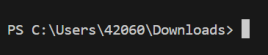

# Nastavení prostředí
Abyste mohli efektivně programovat v *C*, musíte si nainstalovat, nakonfigurovat a naučit se používat
sadu programů. V této kapitole naleznete stručný popis toho, jak si nastavit
[operační systém Linux](linux/linux.md), [textový editor](editor.md)
k psaní programů, [překladač](preklad_programu.md) pro překlad z jazyka *C* do spustitelného souboru
a také jak [řešit chyby](ladeni.md) při psaní programů.

## Prvotní nastavení projektu na WSL
Pokud používáte WSL na Windows a nevíte si rady s tím,
jak přeložit a zprovoznit svůj první program, zkuste následovat návod uvedený níže. Návod přepokládá, že již máte
nainstalované [WSL](./linux/instalace.md#windows-subsystem-for-linux-doporučeno), [editor](./editor.md) a [překladač](./preklad_programu.md).

> Kroky 1, 3 a 4 budete dělat pokaždé, když budete chtít jít programovat.

1) Nejprve je potřeba spustit příkazovou řádku (tzv. terminál), který poběží pod Ubuntu/WSL. Dosáhnete toho tak, že z
   nabídky Start spustíte program `Ubuntu`.
    - Měl by se vám spustit terminál, jehož řádek s textem bude končit znakem `$` nebo `#`:

        
    - Pokud místo toho uvidíte terminál zakončený šipkou `>`, tak jste ve Windows terminálu. To je špatně:

        

2) Nyní je ideální si vytvořit nějakou složku, do které budete dávat své zdrojové kódy. Můžete ji nazvat např. `upr`.
   Spustťe tedy v terminálu příkaz `mkdir upr`, který složku vytvoří.
3) Přepněte se v terminálu do právě vytvořené složky pomocí příkazu `cd upr`.
4) Spusťte editor VSCode v právě aktivní složce (`upr`) pomocí příkazu `code .`
   - Všimněte si tečky na konci příkazu!
5) Nyní můžete vytvořit zdrojový soubor s příponou `.c`, například `main.c`. V liště vlevo nahoře ve VSCode klikněte na
`File -> New File` a vytvořte soubor s názvem `main.c` v současné složce (`upr`).
6) Do souboru `main.c` vložte nějaký C kód, např:
    ```c
    #include <stdio.h>

    int main() {
        printf("Hello world\n");
        return 0;
    }
    ```
7) Otevřete terminál ve VSCode (v liště nahoře `View -> Terminal` nebo zkratka `Ctrl + J`).
8) Ověřte si, že jste ve složce `upr` (například pomocí příkaz `pwd`), a také že v této složce existuje soubor `main.c` (pomocí příkazu `ls`).
9) Přeložte tento soubor překladačem pomocí příkazu `gcc main.c -omain` v terminálu.
10) A finálně přeložený program spusťte pomocí příkazu `./main` v terminálu.
