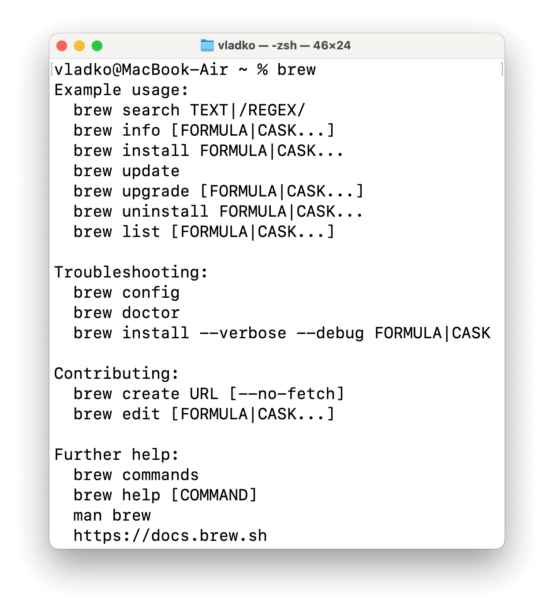
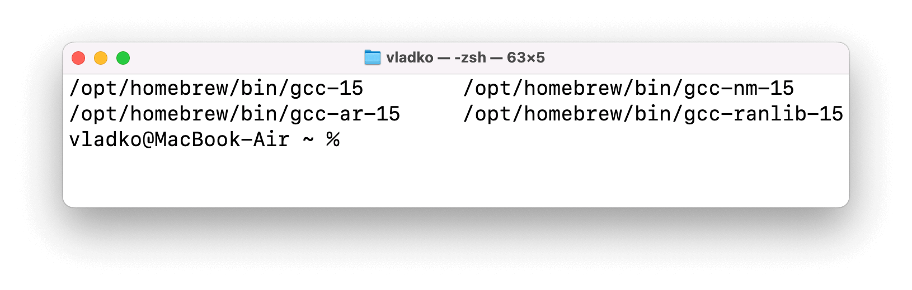
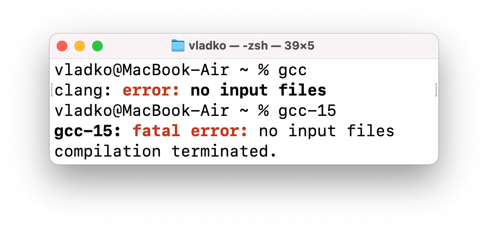

# macOS
Během výuky UPR používáme překladač GCC. Jelikož ve výchozím nastavení není v macOS zahrnutý, musíme ho vlastnoručně nainstalovat.

Nejprve musíme nainstalovat nástroje příkazového řádku, tzv. _Xcode Command Line Tools_:

Otevřete si `Terminál`[^1] pomocí Launchpadu nebo Spotlightu (⌘ + mezerník) a zadejte následující příkaz:

[^1]: Více o práci s terminálem se dozvíte v sekci [Operační systém](os.md)

```zsh
$ xcode-select --install
```

> Při pokusu o instalaci vás program vyzve, abyste instalaci potvrdili. Udělejte to stisknutím klávesy `y`
> a potvrďte klávesou Enter.

## Instalace Homebrew

Abychom zjednodušili postup, nainstalujeme [správce balíčků](https://cs.wikipedia.org/wiki/Správce_balíčků), konkrétně [Homebrew](https://brew.sh/cs/), který se vám jistě ještě bude hodit.

Pro instalaci vložte do okna terminálu:

```zsh
$ /bin/bash -c "$(curl -fsSL https://raw.githubusercontent.com/Homebrew/install/HEAD/install.sh)"
```

Jestliže jste neměli předtím nainstalované _Xcode Command Line Tools_, Homebrew je také nainstaluje.

> ⚠️ Po plné instalaci Homebrew se zobrazí odstavec: `Next steps`. V něm budou uvedeny příkazy, které musíte také spustit, aby vám příkaz `brew` fungoval.

V případě, že máte všechno nainstalováno správně, po zadání příkazu `brew` v terminálu uvidíte následující:

<center></center>

## Instalace GCC

Teď můžeme jednoduše nainstalovat GCC pomocí:

```zsh
$ brew install gcc
```

## Spouštění GCC

Po instalaci nástrojů příkazového řádku můžeme zkusit použít příkaz `gcc`, ale ve skutečnosti se spustí jiný, zabudovaný do macOS překladač Clang.

Abychom mohli spouštět příkazy GCC, musíme použít: `gcc-<verze>`.

Zjistit, jakou verzi GCC máme nainstalovanou, můžeme pomocí:

```zsh
$ ls -l /opt/homebrew/bin/gcc-*
```

Po spuštění uvidíte něco jako:

<center></center>

Lze vidět, že výsledek obsahuje cesty do složek překladače, ve kterých se často opakuje `gcc-15`, tzn. verze GCC je 15.

Takže, pro používání GCC budeme vždy psát `gcc-15 ...`. Pokud máme jinou verzi, určitě budeme v příkazu psát jiné číslo.

Ověříme to a porovnáme s příkazem `gcc`:

<center></center>

Příkaz s určením verze opravdu volá GCC.

Teď můžeme dál nastavovat prostředí. Zbytek postupu bude téměř úplně stejný jako na Linuxu, až na pár klávesových zkratek a instalačních detailů.
