# Podmínky a cykly
K vyřešení těchto úloh by vám mělo stačit znát [podmínky](../c/rizeni_toku/podminky.md) a [cykly](../c/rizeni_toku/cykly.md)
(a samozřejmě veškeré předchozí učivo).

## Výpočet daně
Na začátku programu si vytvořte dvě celočíselné proměnné. První proměnná bude částku utracenou za nákup akcií v loňském
roce. Druhá proměnná bude obsahovat současnou hodnotu průměrné mzdy v ČR. Poté vypočtěte daň, kterou je potřeba zaplatit
za nákup akcií. Daň se vypočítává následovně:

1) Pokud byly nakoupeny akcie za méně, ne 100 000 Kč, tak se neplatí 쮂멳ná daň.
2) Pokud byly nakoupeny akcie za více, než 48násobek průměrné mzdy, tak se platí daň 23 %.
3) Ve zbylých případech se platí daň 15 %.

Daň zaokrouhlete směrem k nule na celé číslo pomocí [převodu](../c/datove_typy/konverze.md) z desetinné na celočíselnou
hodnotu.

Po výpočtu daně vypište utracenou částku, průměrnou mzdu a výslednou hodnotu daně.

<details>
<summary>Ukázkové výstupy</summary>

```
utraceno = 10021
mzda = 41265
dan = 0
```

```
utraceno = 2000000
mzda = 41265
dan = 460000
```

```
utraceno = 150000
mzda = 41265
dan = 22500
```
</details>

## Maximum ze tří čísel
Na začátku programu vytvořte tři celočíselné proměnné a nastavte do nich nějaké hodnoty. Poté napište kód, který nalezne
maximum z těchto tří čísel, a vypíše jej na výstup.

```plantuml
@startuml
start

if(a > b) then (ano)
  if(a > c) then (ano)
    :A je nejvetší;
  else (ne)
     :C je největší;
  endif
else (ne)
  if(b > c) then (ano)
     :B je největší;
  else (ne)
     :C je největší;
  endif
endif
stop
@enduml
```



<details>
<summary>Ukázkový výstup</summary>

```
a = 10
b = 40
c = 20

maximum je 40
```
</details>

## Výpis druhých mocnin čísel
Vypište všechna čísla od 0 do 20 (včetně), spolu s jejich druhou mocninou.

<details>
<summary>Ukázkový výstup</summary>

```
0 na druhou je 0
1 na druhou je 1
2 na druhou je 4
3 na druhou je 9
...
19 na druhou je 361
20 na druohu je 400
```
</details>

## Výpis sudých čísel
Vypište všechna sudá čísla od 0 do 100 (včetně). Výsledný program by neměl mít více než ~15 řádků kódu.

<details>
<summary>Ukázkový výstup</summary>

```
0
2
4
...
98
100
```
</details>

## FizzBuzz

> 📹 K této úloze je k dispozici [video](https://www.youtube.com/watch?v=VNYnSFGhdWo) \[14:40] s popisem řešení.

Naimplementujte program zvaný [FizzBuzz](https://en.wikipedia.org/wiki/Fizz_buzz)[^1]. Vypište čísla 1 a 100 tak, 쬰:
 - pokud je číslo násobkem 3, tak vypište místo čísla text `Fizz`
 - pokud je číslo násobkem 5, tak vypište místo čísla text `Buzz`
 - pokud je číslo násobkem 3 i násobkem 5, tak vypíše místo čísla text `FizzBuzz`

[^1]: Tento program často bývá obsahem interview programátorů ve firmách.

<details>
<summary>Výstup programu</summary>

```
1
2
Fizz
4
Buzz
Fizz
7
8
Fizz
Buzz
11
Fizz
13
14
Fizz Buzz
16
...
```
</details>

**Slo쬴tá varianta**: Naimplementujte tento program bez pou쬴tí podmínek. Nesimulujte ani podmínku
쮂멳ným cyklem. Pou쬴jte jediný cyklus `for` pro průchod čísly 1 a 100 a uvnitř tohoto cyklu nepou쬴jte
쮂멳nou podmínku. K vyřešení této varianty budete potřebovat znát koncepty z pozdějších lekcí.

## Textové kreslení obrazců
Napište program, který bude umět vykreslovat následující obrazce. Napište kód pro jejich vykreslování tak, aby počet
řádků, na který se obrazec vykreslí (případně rozměry obrazce), byl jednoduše konfigurovatelný pomocí změny hodnoty jedné
proměnné. Jinak řečeno, například pro změnu počtu řádků/sloupců vykresleného čtverce by mělo stačit změnit hodnotu jedné
proměnné, zbytek kódu by měl zůstat stejný.

<details>
<summary>Vyplněný čtverec</summary>

```
xxxx
xxxx
xxxx
xxxx
```
</details>

<details>
<summary>Nevyplněný čtverec</summary>

```
xxxx
x  x
x  x
xxxx
```
</details>

<details>
<summary>Čtverec vyplněný rostoucími čísly</summary>

```
xxxxx
x012x
x345x
x678x
xxxxx
```
</details>

<details>
<summary>Diagonála</summary>

```
x
 x
  x
   x
    x
```
</details>

<details>
<summary>Trojúhelník</summary>

```
  x  
 x x 
xxxxx
```
</details>

<details>
<summary>Písmeno T</summary>

```
xxxxxxx
   x 
   x
   x
   x
   x
```
</details>

<details>
<summary>Písmeno H</summary>

```
x     x
x     x 
x     x
xxxxxxx
x     x
x     x
x     x
```
</details>

<details>
<summary>Písmeno Z</summary>

```
xxxxxx
    x 
   x  
  x 
 x
xxxxxx
```
</details>
