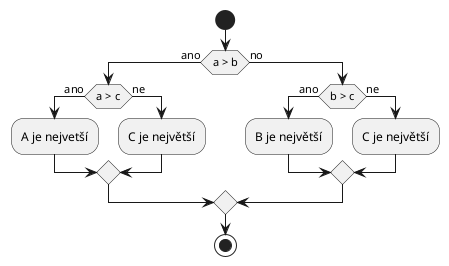

# Základy

## Obvod a obsah obdélníku
Program vypočítá a vypíše obvod a obsah obdélníku ze dvou celočíselných velikosti stran \\( a \\), \\( b \\) podle známých vzorců.

<div style="display: flex; justify-content: center">
  <svg>
    <rect width=200 height=100 fill=#eee stroke=black />
    <text x=100 y=115 fill=black text-anchor=middle font-style=italic>a</text>
    <text x=210 y=50 fill=black text-anchor=middle font-style=italic>b</text>
  </svg>
  <div>
    $$\begin{aligned}
    o &= 2 \cdot (a + b) \\
    S &= a \cdot b
    \end{aligned}$$
  </div>
</div>

<details>
<summary>Výstup</summary>

```
a = 200
b = 100
o = 600
S = 20000
```
</details>

## Obsah vyšrafované plochy
Ze zadané délky strany čtverce \\( a \\) a průměru kružnice \\( d \\) vypočítáme obsah vyšrafované plochy.
Výpočet budeme provádět pomocí datového typu `float` s využitím konstanty `M_PI` z knihovny `<math.h>`.
Druhou mocninu vypočítáme násobením, ale také pomocí funkce `pow` .
Při použití matematických funkcí je nutné program [linkovat](../c/modularizace/knihovny.md) s
knihovnou `math`[^10]. Výsledek zapíšeme na výstup na 4 desetinná místa. 

[^10]: Pro překlad s touto knihovnou použijte `-lm`:
```bash
$ gcc obsah.c -o obsah -lm
```

<div style="display: flex; justify-content: center">
	<svg viewBox="0 0 130 130" width=130 height=130>
		<pattern id="diagonalHatch" patternUnits="userSpaceOnUse" width="4" height="4">
		<path d="M-1,1 l2,-2
		M0,4 l4,-4
		M3,5 l2,-2" 
		style="stroke:black; stroke-width:1" />
		</pattern>
		<rect width=100 height=100 stroke=black fill="url(#diagonalHatch)" />
		<text x=50 y=115 fill=black text-anchor=middle font-style=italic>a</text>
		<text x=110 y=50 fill=black text-anchor=middle font-style=italic>a</text>
		<circle r=50 cx=50 cy=50 fill=#eee stroke=black />
		<text x=75 y=65 fill=black text-anchor=middle font-style=italic>r</text>
		<line x1=50 y1=50 x2=100 y2=50 stroke=black />
	</svg>
	<div>
		$$ S_{kruh} = \frac{\pi \cdot d^2}{4} $$
	</div>
</div>

<details>
<summary>Výstup</summary>

```
a = 8
r = 4
S = 50.27
```
</details>

## Prohození dvou čísel
Pomocí dočasné proměnné provedeme prohození čísel ve dvou proměnných.

<details>
<summary>Výstup</summary>

```
a = 10
b = 50

a = 50
b = 10
```
</details>

## Maximum ze tří čísel

Ze tří čísel nalezneme maximum.



<details>
<summary>Výstup</summary>

```
a = 10
b = 40
c = 20

maximum je 40
```
</details>


## Výpis sudých čísel
Vypište sudá čísla od 0 do 100 (včetně).

## FizzBuzz
Naimplementujte [FizzBuzz](https://en.wikipedia.org/wiki/Fizz_buzz)[^1]. Vypište čísla 1 až 100 tak, že:
 - pokud je číslo násobkem 3, tak vypište místo čísla `Fizz`
 - pokud je číslo násobkem 5, tak vypište místo čísla `Buzz`
 - pokud je číslo násobkem 3 i násobkem 5, tak vypíše místo čísla `FizzBuzz`

[^1]: Tento program často bývá obsahem interview programátorů ve firmách.

<details>
<summary>Výstup programu</summary>

```
1
2
Fizz
4
Buzz
Fizz
7
8
Fizz
Buzz
11
Fizz
13
14
Fizz Buzz
16
...
```
</details>

## Fibonacciho číslo
Napište funkci, která vypočte `n`-té [Fibonacciho číslo](https://cs.wikipedia.org/wiki/Fibonacciho_posloupnost)
(`n` bude parametrem funkce).

<details>
<summary>Výstup funkce</summary>

```c
fibonacci(0);   // 0
fibonacci(1);   // 1
fibonacci(2);   // 1
fibonacci(3);   // 2
fibonacci(4);   // 3
fibonacci(5);   // 5
fibonacci(6);   // 8
```
</details>

## Faktoriál
Napište funkci, která vypočte [faktoriál](https://cs.wikipedia.org/wiki/Faktori%C3%A1l) předaného
parametru.

<details>
<summary>Výstup funkce</summary>

```c
factorial(0);   // 1
factorial(1);   // 1
factorial(4);   // 24
factorial(5);   // 120
```
</details>

## Textové kreslení obrazců
Vykreslete následující obrazce. Napište program tak, aby počet řádků, na který se
obrazec vykreslí, byl konfigurovatelný, tj. pro změnu počtu řádků by mělo stačit změnit jediný řádek
(jedinou proměnnou).

<details>
<summary>Vyplněný čtverec</summary>

```
xxxx
xxxx
xxxx
xxxx
```
</details>

<details>
<summary>Nevyplněný čtverec</summary>

```
xxxx
x  x
x  x
xxxx
```
</details>

<details>
<summary>Čtverec vyplněný rostoucími čísly</summary>

```
xxxxx
x012x
x345x
x678x
xxxxx
```
</details>

<details>
<summary>Diagonála</summary>

```
x
 x
  x
   x
    x
```
</details>

<details>
<summary>Trojúhelník</summary>

```
  x  
 x x 
xxxxx
```
</details>

<details>
<summary>Písmeno Z</summary>

```
xxxxxx
    x 
   x  
  x 
 x
xxxxxx
```
</details>

## Načítání PINu
Načtěte od uživatele PIN (4 číslice). Poté opakovaně vyzývejte uživatele k zadání PINu. Pokud
uživatel zadá 3x nesprávný PIN, vypište chybovou hlášku a ukončete program.
